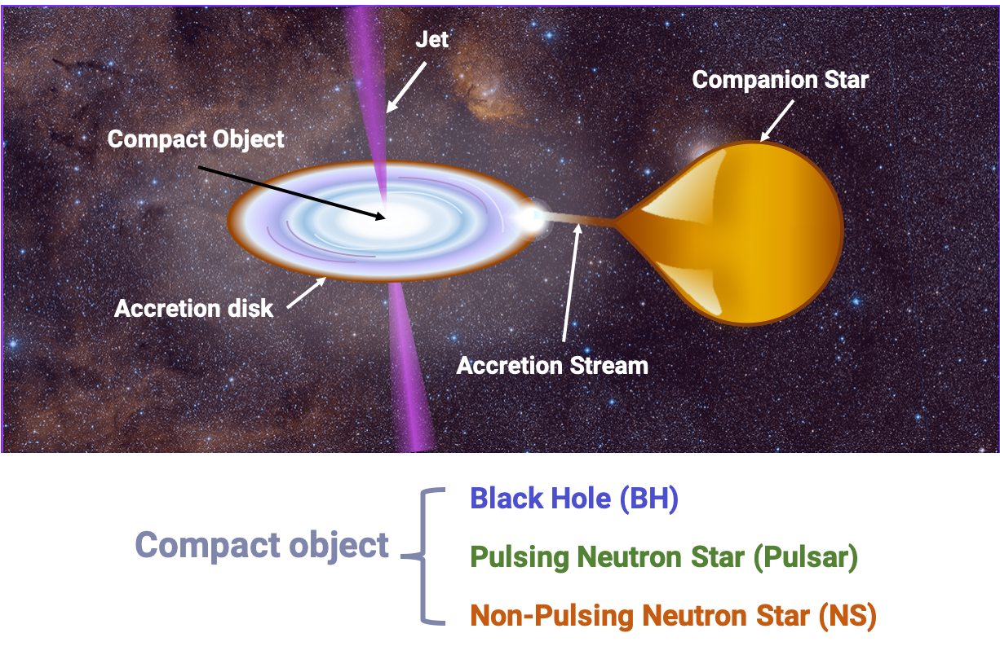

# X-ray Binary ML: 3 Machine Learning Methods for Classifying the Compact Objects in X-ray Binaries

**What are X-ray Binaries?** X-ray  binaries  (XRBs)  consist  of  a  compact  object accreting  matter  from  a  main  sequence  or  supergiant companion  star,  orbiting  the  common  center  of  mass.

## Code Author

Zoe de Beurs: [@zdebeurs](https://github.com/zdebeurs)

We customized code from the LIBSVM library (Chang & Lin 2011), the class package (Venables & Ripley 2002), and the Kernlab library (Karatzoglou et al. 2004).

## Background

This directory contains Machine Learning Algorithms (Bayesian Gaussian Process,
 K-Nearest Neighbors, Support Vector Machines) for classifying the compact objects
  in X-ray Binaries. For more details, see [our live-broadcasted talk](https://youtu.be/c6SgxjjYLPk) at the SAO Astronomy Summer Intern Symposium 2019. 
  
## Citation

If you find this code useful, please cite our poster or our paper:

[de Beurs, Z. L., Islam, N., Gopalan, G., & Vrtilek, S.D. 2020, American Astronomical Society Meeting Abstracts, 170.12](https://113qx216in8z1kdeyi404hgf-wpengine.netdna-ssl.com/wp-content/uploads/2020/01/aas235_abstracts.pdf#abs170.12)

or

de Beurs, Z. L., Islam, N., Gopalan, G., & Vrtilek, S.D. (2020). A Comparative Study of Machine Learning Methods for X-ray Binary Classification. Submitted to ApJ. 

# Walkthrough

## Setup

First, ensure that you have installed the
[required packages](../../README.md#required-packages) and that the
[unit tests](../../README.md#run-unit-tests) pass.

